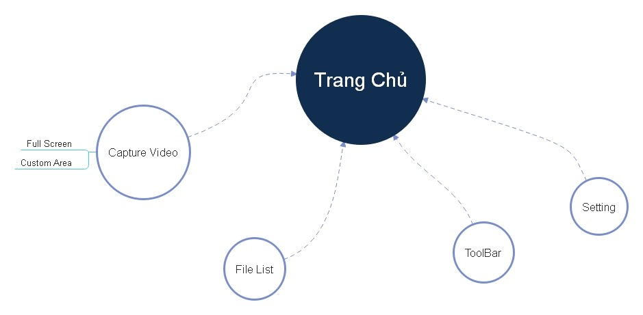
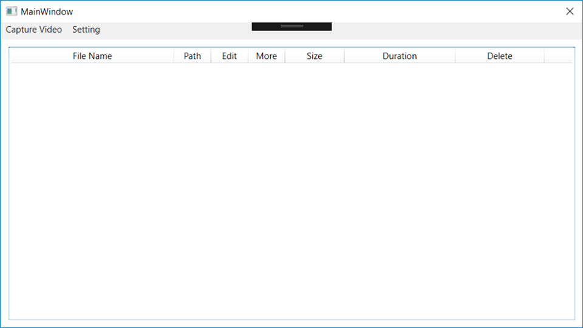
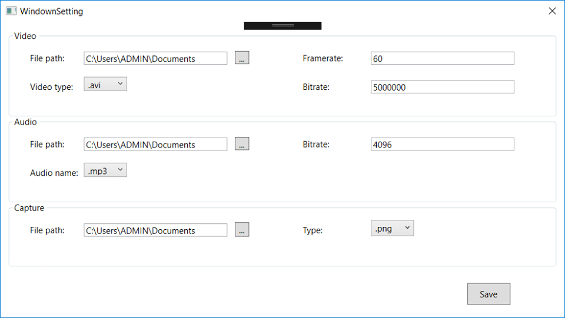
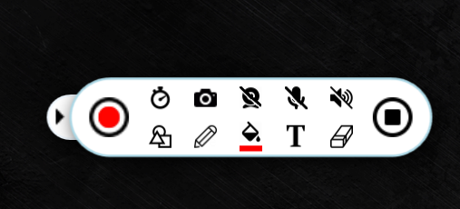
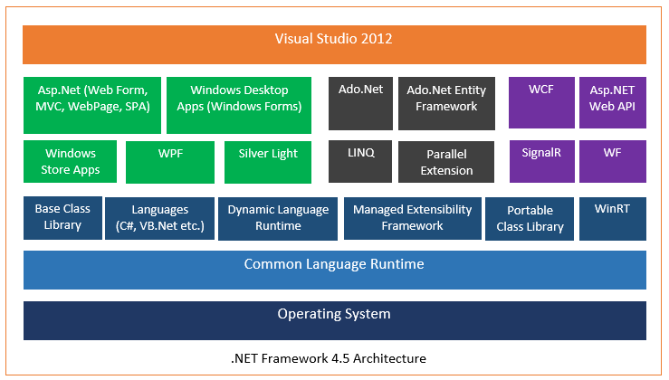
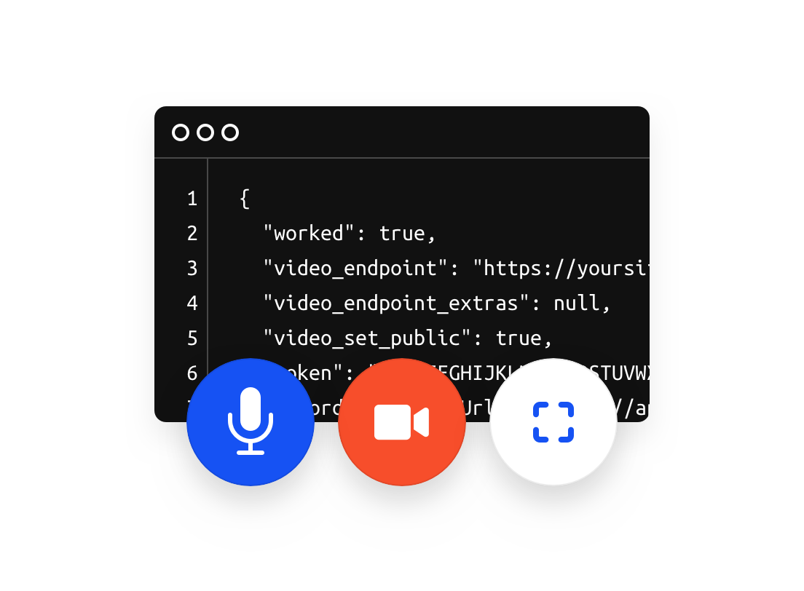
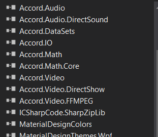

# ScreenRecoder-app
App for you record your computer screen
---
#DISPLAY:

---

#HOMEPAGE :

HomePage bao gồm : Capture Video, File list và Setting. 
*	Từ trang chủ, sau khi chọn capture video sẽ có 2 sự lựa chọn : Full Screen và Custom area. 
*	File list chứa thông tin về file đã được quay : File name, Path, Edit, More, Size, Duration, Delete.

---

#CAPTURE VIDEO:

*	Capture Video cho người dùng 2 lựa chọn quay video : Full Screen hoặc Custom Area.
*	Đồng thời, cũng sẽ xuất hiện Toolbar điều chỉnh trong lúc quay video.

---

#SETTING :

*	Setting bao gồm các path lưu video và audio, Framerate, Bitrate của video hay audio.

---

#CUSTOM :

Có các phần tùy chỉnh bao gồm :
*	Start quay vieo
*	Stop
*	Đồng hồ thời gian quay
*	Chụp ảnh
*	Web cam
*	Ghi âM Âm thanh
*	Vẽ hình
*	Nét bút
*	Màu
*	Font chữ
*	Xóa hình và chữ viết

---

#TECHNOLOGY : 

.NET Framwork :

NET Framework bao gồm 3 công nghệ khác nhau:

    *	Common Language Runtime(CLR).
    *	Các lớp cơ sở của framework (Framework Based Classes – FBC).
    *	Các giao diện chương trình (Web, Winform, Windows Phone …).

C# :

* C# là một ngôn ngữ cấp cao và thuần hướng đối tượng, hỗ trợ rất mạnh trong việc xây dựng các ứng dụng trên môi trường Windows. Đối với những lập trình viên đã từng sử dụng qua C, C++, hoặc Java, việc nắm bắt và sử dụng C# một cách hiệu quả là khá dễ dàng và ít tốn thời gian.
* Mã nguồn được viết bằng ngôn ngữ C# sẽ được dịch sang một ngôn ngữ tầm trung (Intermediate Language) phù hợp với các đặc tả của Common Language Infrastructure (CLI), và được lưu trữ trong các tập tin thực thi (thường có đuôi là .exe hay .dll.

---

#API :

OVERVIEW OF THE FEATURES OF THIS API :

* API trình ghi màn hình này có thể đáp ứng hầu hết tất cả các nhu cầu ghi màn hình của bạn. Bằng cách sử dụng nó, bạn có thể chụp bất kỳ vùng màn hình tùy chỉnh nào dưới dạng video cùng với âm thanh từ âm thanh hệ thống máy tính, micrô hoặc cả hai. Tương tự như vậy, bạn cũng có thể chọn ghi lại toàn màn hình, webcam hoặc thậm chí tạo video hình ảnh trong ảnh.

* Khi tạo screencast với API này, bạn sẽ được cung cấp một số tùy chọn chú thích như dòng, mũi tên, văn bản và nhiều tùy chọn khác để ghi âm của bạn có tính hướng dẫn và sinh động hơn. Khi bạn đã hoàn tất việc chụp, bạn sẽ có thể lưu những gì bạn đã ghi ở các định dạng video và GIF khác nhau.
---

#LIBRARY :

[Framework modules Using](http://accord-framework.net/docs/html/R_Project_Accord_NET.htm?fbclid=IwAR3EyGLu-C3qs8zXYj9AHZp6bb0aBkq6Ep51E4huocqBuURC2PjcDNTya84#!)

---

#NHÓM TÁC GIẢ :

* Huỳnh Quốc Trung
* Nguyễn Tài Bồi
* Nguyễn Ngọc Hiển
* Lý Đạo Nam
* Phan Xuân Hào

